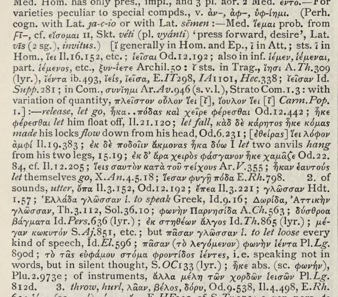
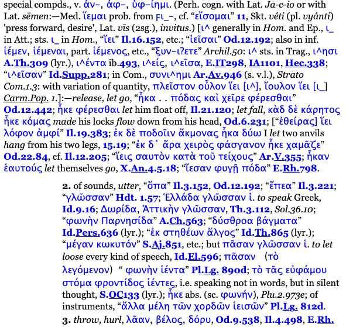
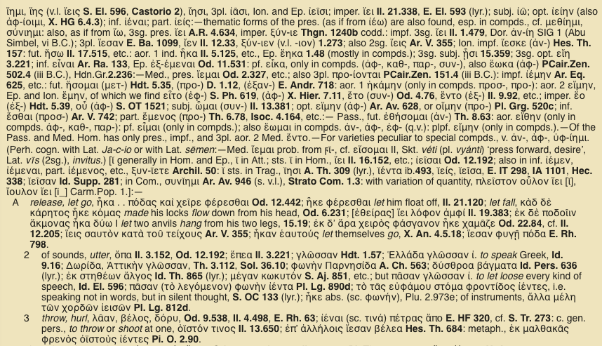
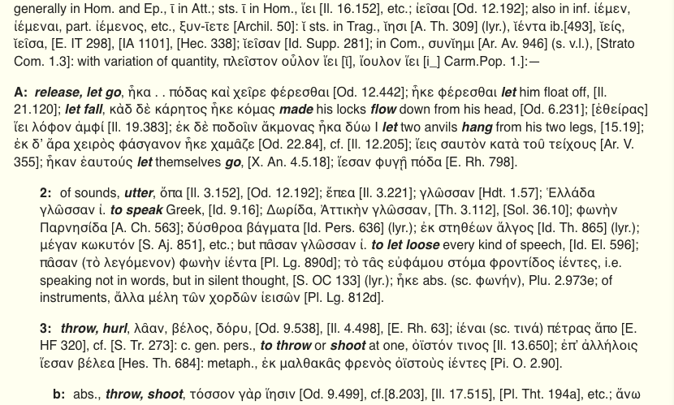

# Analogeion

Browser extension for improving the display of LSJ entries in [Logeion](https://logeion.uchicago.edu/).

I love Logeion and find incredibly useful, but Greek dictionaries don't have a very good tradition of readability and I think Logeion has adopted some unfortunate practices from the [Perseus Project](https://www.perseus.tufts.edu/hopper/), which in turn are inherited from Liddell, Scott, and Jones's _A Greek-English Lexicon_ (usually called _LSJ_).

## Changes

1. Background is lighter
1. Text size and line spacing increased
1. Better indentation in sections of the entry
1. Bold weight removed from citations; they are enclosed in brackets
1. Italic definitions also bold so that they are easier to find

## Explanation 

LSJ pages are extraordinarily dense. Many entries, especially for common verbs, begin with a long section listing attested forms and linguistic cognates which is not usually what the student wants. Definitions are run together and it's hard to scan the entries to get a sense of the semantic range of the word. For instance, here is part of the entry for the word ἵημι--it is hard, in this wall of text, to find the several translations given, such as "release, let go", "utter", "to speak", and "throw, hurl"

The Perseus version of [this entry](http://www.perseus.tufts.edu/hopper/text?doc=Perseus%3Atext%3A1999.04.0057%3Aentry%3Di\(%2Fhmi) is a bit better, since it at least uses indentation:

But because Perseus makes links out of all the Greek words and citations of literature, the actual definitions get somewhat lost in all the blue and bold text.

Logeion makes it _much_ easier to find an entry [like this](https://logeion.uchicago.edu/%E1%BC%B5%CE%B7%CE%BC%CE%B9), but I find the text pretty cramped and, since the links are gone, the bold citations are even more visible and distracting. It's much easier to see that the word is used at Thucydides 3.112 than to see that it's used there in with the sense of "speak."

Analogeion attempts to make this more readable by making the changes listed above. The most visible elements are the English definitions, which are what most people are really looking for.

